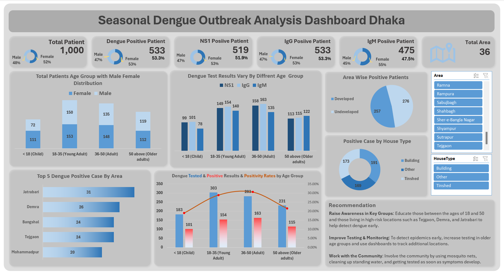

Here is my another project about Dengue outbreak in Bangladesh (Dhaka Region). Let’s break this down into KPI monitoring, insights

🔍 KPI Monitoring Highlights :
👨‍⚕️ Total Patients Tested: 1,000
🦠 Dengue Positive Patients: 533 (53.3%)
🧪 NS1 Positive: 519
🧬 IgG Positive: 533
🧫 IgM Positive: 475
📍 Total Areas Analyzed: 36

📈 Key Insights
1. 🎯 High Positivity in Young and Middle-aged Adults (18–50 years)
18–35 group had highest testing (303) and positivity rate ~33.7%
36–50 group close behind, both in test numbers and positivity
👥 Suggestion: Prioritize education and early detection in this age group

2. 🏘️ Unexpected High Positivity in Developed Areas
Developed areas: 276 positive cases
Undeveloped areas: 257
 ➡️ Challenge the assumption that dengue is only a slum-area disease. Interventions must be city-wide, not just in low-income zones.

3. 🧱 High Cases in Multi-story Buildings
Highest positive cases found in “Building” house types (191)
Breaks the myth that dengue only affects tin-shed/ground-level houses
 🔧 Suggest: Include apartment areas in fogging campaigns and inspections

4. 📍 Top Hotspot Areas
Jatrabari, Demra, Bangshal, Tejgaon, Mohammadpur have the highest concentration
 ➡️ Data-driven zoning can help in targeted fogging, awareness drives, and mobile test centers

5. 👩‍⚕️ Balanced Gender Distribution
Slightly more female patients across all tests
⚖️ Equal risk highlights need for gender-neutral community health campaigns

📌 Recommendations:
Expand awareness programs beyond slum areas
Educate 18–50-year-olds for early symptom reporting
Include high-rise buildings in vector control drives

Tools Used: Excel (Pivot Table, Charting, Custom Layouts)
